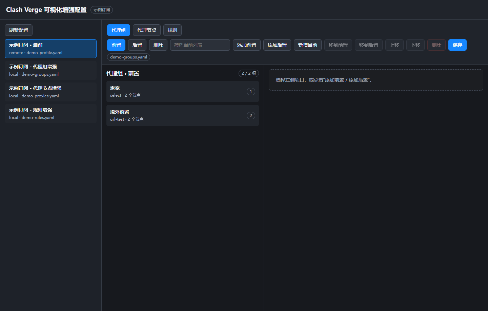
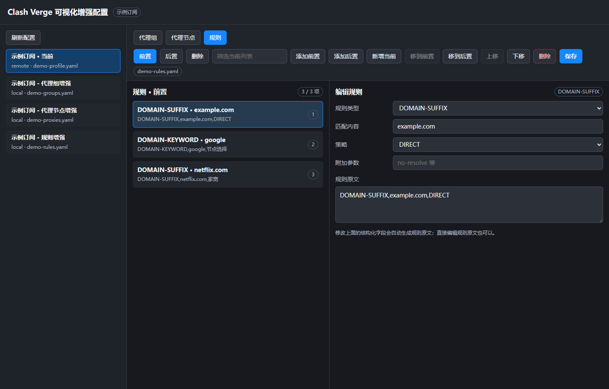
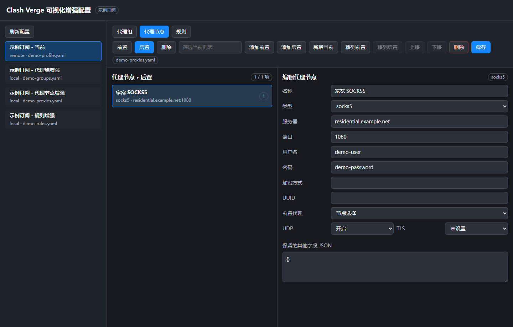
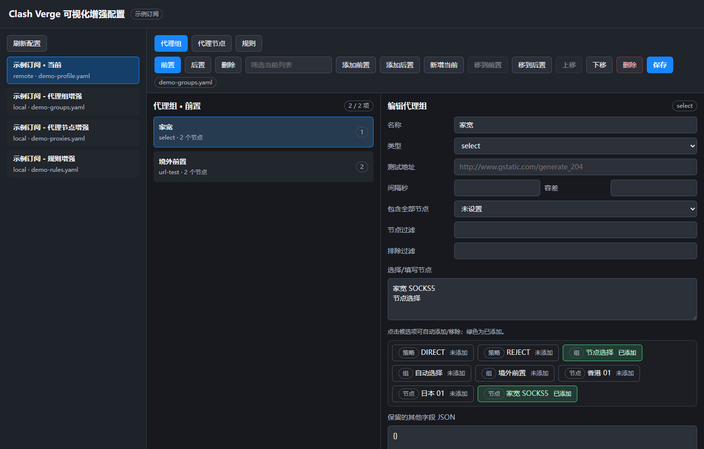

# 图文教程：按真实 Web 界面快速上手

这份教程使用本工具真实运行后的 Web 界面截图编写。截图里的订阅、节点、服务器、账号和密码都是演示数据，不是任何真实订阅。

## 一、先理解界面分区

打开桌面快捷方式 `Clash Verge Config UI` 后，会进入下面这个页面。



界面从左到右可以分成 3 个区域：

- 左侧：订阅列表。选择你要编辑的订阅。
- 中间：当前分类下的项目列表。比如代理组、代理节点、规则。
- 右侧：具体编辑表单。点中间的项目后，在这里修改内容。

顶部有 3 个主功能：

- `代理组`：编辑 Clash 里的 proxy-groups。
- `代理节点`：编辑 Clash 里的 proxies。
- `规则`：编辑 Clash 里的 rules。

每个功能下面都有 3 个位置：

- `前置`：把配置插到订阅原配置前面，优先级更高。
- `后置`：把配置追加到订阅原配置后面。
- `删除`：按 Clash Verge Rev 增强配置的 delete 语义删除项目。

## 二、第一次使用前要先创建增强文件

如果某个订阅打开后提示“当前订阅没有绑定增强文件”，需要先回到 Clash Verge Rev 创建文件。

操作方法：

1. 打开 Clash Verge Rev。
2. 进入 `订阅` 页面。
3. 右键你的订阅。
4. 分别打开一次：

```text
编辑代理组
编辑代理节点
编辑规则
```

打开过一次后，Clash Verge Rev 会生成增强配置文件。本工具才能读取和保存。

## 三、编辑规则

点击顶部 `规则`，再选择 `前置`，界面会像下面这样。



图中示例规则是：

```text
DOMAIN-SUFFIX,example.com,DIRECT
```

它的意思是：

- 匹配类型：`DOMAIN-SUFFIX`
- 匹配内容：`example.com`
- 使用策略：`DIRECT`

添加新规则的步骤：

1. 点击顶部 `规则`。
2. 点击 `前置`。
3. 点击 `添加前置`。
4. 在右侧选择规则类型，例如 `DOMAIN-SUFFIX`。
5. 在 `匹配内容` 填写域名，例如 `example.com`。
6. 在 `策略` 选择 `DIRECT`、`节点选择`、`家宽` 或其它代理组。
7. 点击右上角 `保存`。

常见写法：

```text
DOMAIN-SUFFIX,example.com,DIRECT
DOMAIN-KEYWORD,google,节点选择
DOMAIN-SUFFIX,netflix.com,家宽
```

规则建议优先放在 `前置`，这样能比订阅自带规则更早匹配。

## 四、编辑代理节点

点击顶部 `代理节点`，选择 `后置`，再点中间列表里的节点，会看到下面的编辑表单。



这个页面适合添加家宽 SOCKS5、HTTP 或其它手动节点。

重要字段说明：

- `名称`：节点显示名称，例如 `家宽 SOCKS5`。
- `类型`：节点协议，例如 `socks5`。
- `服务器`：节点服务器地址。
- `端口`：节点端口。
- `用户名 / 密码`：节点认证信息，没有就留空。
- `前置代理`：也就是 Clash 的 `dialer-proxy`。

如果你的家宽节点必须境外网络才能访问，就在 `前置代理` 里选择一个能出境的代理组，例如：

```text
节点选择
```

链路会变成：

```text
电脑 -> 节点选择 -> 家宽 SOCKS5 -> 目标网站
```

添加家宽节点的步骤：

1. 点击 `代理节点`。
2. 选择 `后置`。
3. 点击 `添加后置`。
4. 类型选择 `socks5`。
5. 填写服务器、端口、用户名、密码。
6. `前置代理` 选择 `节点选择` 或你的境外前置组。
7. 点击 `保存`。

## 五、编辑代理组

点击顶部 `代理组`，选择 `前置`，点中间列表里的代理组，会看到下面的页面。



右侧下半部分是候选节点和候选代理组。

绿色代表已经添加：

```text
已添加
```

灰色代表还没添加：

```text
未添加
```

点击候选项可以自动添加或移除，不需要手写节点名称。

创建 `家宽` 代理组的步骤：

1. 点击 `代理组`。
2. 点击 `添加前置` 或 `添加后置`。
3. 名称填写 `家宽`。
4. 类型选择 `select`。
5. 在候选区点击 `家宽 SOCKS5`。
6. 需要备用出口时，也可以添加 `节点选择`。
7. 点击 `保存`。

如果你希望一组节点自动测速并切换，可以把类型改成：

```text
url-test
```

然后填写测试地址：

```text
https://www.gstatic.com/generate_204
```

## 六、保存后如何生效

点击本工具右上角 `保存` 只是把增强配置写入文件。保存后还需要回到 Clash Verge Rev 让它重新应用配置。

推荐步骤：

1. 回到 Clash Verge Rev。
2. 重新应用当前订阅，或切换一次 Profile。
3. 打开 `代理` 页面，检查新增代理组或节点是否出现。
4. 打开 `规则` 页面或测试访问目标网站，确认规则是否生效。

每次保存前，本工具都会自动创建备份：

```text
.bak-YYYYmmdd-HHMMSS
```

如果改错了，可以用备份文件恢复。

## 七、常见问题

### 为什么 Clash Verge 的网页界面不能直接启动本工具？

Clash Verge 的 `网页界面` 只能打开 URL，不能启动本地程序。

可以把下面这个地址添加到 Clash Verge 的网页界面：

```text
http://127.0.0.1:8787
```

但前提是本工具已经启动。

### 为什么截图不用真实订阅？

真实截图可能包含订阅名称、节点域名、用户名、密码等敏感信息。教程截图使用真实 Web 界面加演示数据，既能看清操作位置，也不会泄露隐私。

### 订阅更新后增强配置会不会丢？

本工具编辑的是 Clash Verge Rev 的增强配置文件，不是订阅原文。正常情况下订阅更新不会覆盖这些增强配置。
