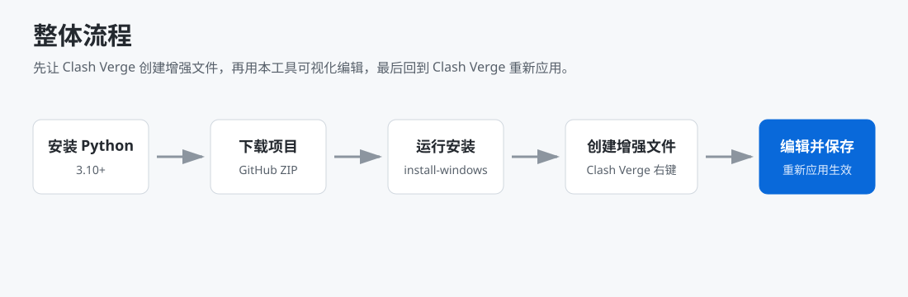
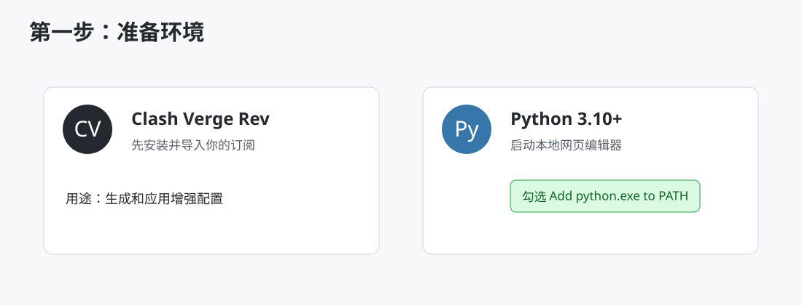
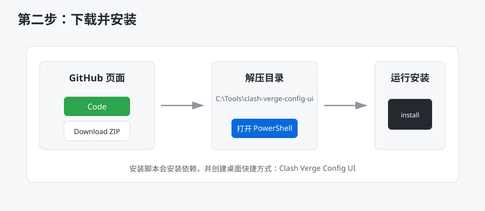
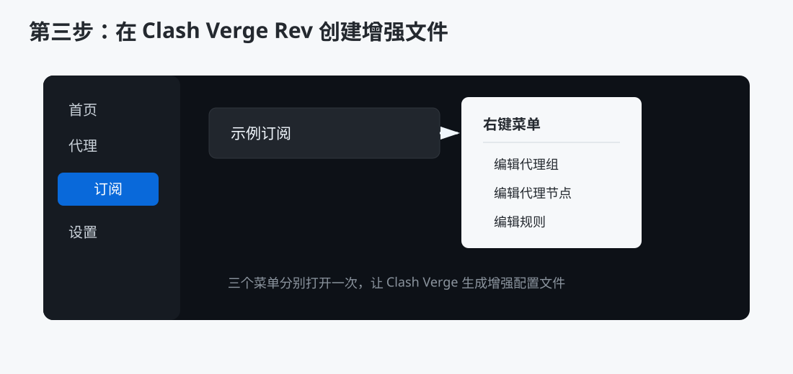
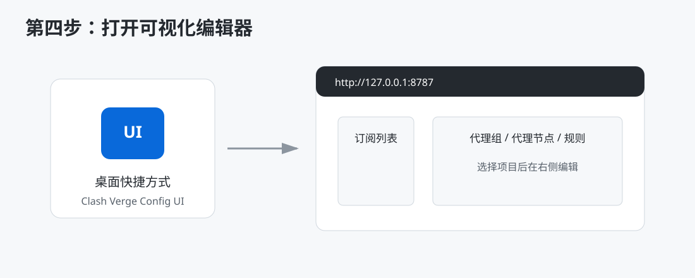
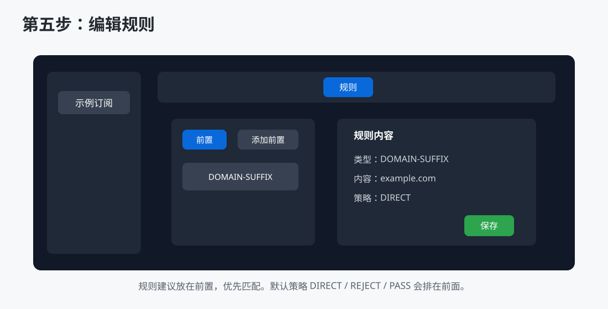
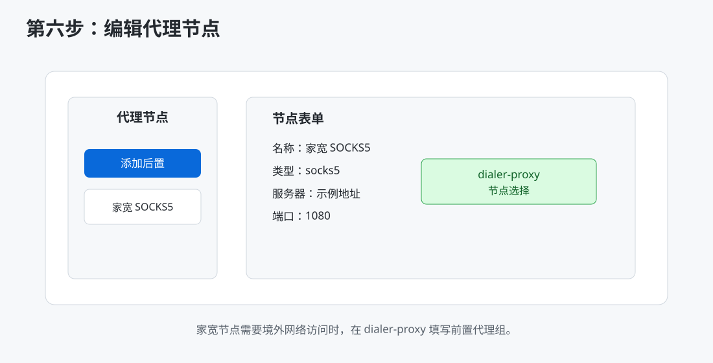
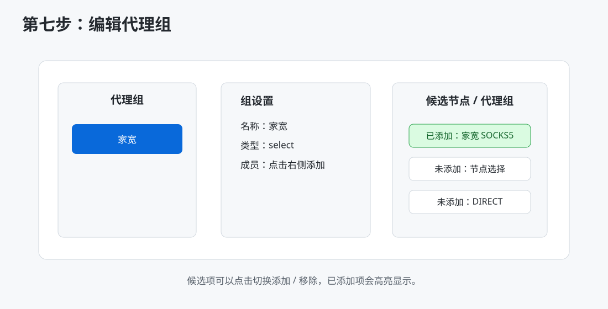
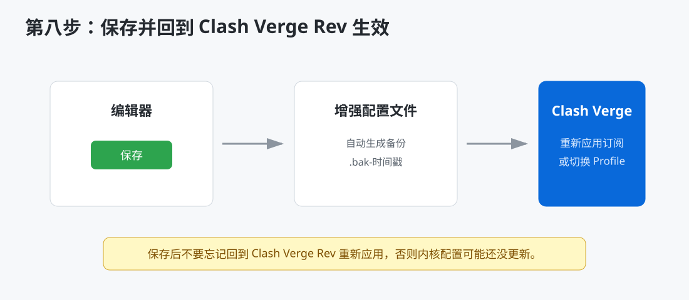

# 图文教程：从下载安装到保存生效

这份教程按新手流程写，不需要先理解 YAML。照着步骤做，就可以在本机打开可视化编辑器，给 Clash Verge Rev 的订阅添加规则、节点和代理组增强配置。

## 先看整体流程



简单理解：

1. 先安装 Python。
2. 下载本项目。
3. 运行安装脚本。
4. 在 Clash Verge Rev 里让订阅生成增强配置文件。
5. 打开本工具编辑。
6. 保存后回到 Clash Verge Rev 重新应用订阅。

## 第一步：准备环境



你需要先准备两个软件：

- Clash Verge Rev：你平时使用的代理客户端。
- Python 3.10 或更高版本：本工具需要它启动本地网页。

安装 Python 时一定要勾选：

```text
Add python.exe to PATH
```

如果忘记勾选，后面双击启动可能会提示找不到 Python。

## 第二步：下载并安装本工具



### GitHub ZIP 下载方式

1. 打开项目 GitHub 页面。
2. 点击绿色 `Code` 按钮。
3. 点击 `Download ZIP`。
4. 解压到固定目录，例如：

```text
C:\Tools\clash-verge-config-ui
```

5. 在解压目录空白处按住 `Shift`，鼠标右键，选择 `在终端中打开` 或 `在 PowerShell 中打开`。
6. 运行：

```powershell
powershell -ExecutionPolicy Bypass -File .\install-windows.ps1
```

安装完成后，桌面会出现：

```text
Clash Verge Config UI
```

## 第三步：让 Clash Verge Rev 创建增强配置文件



第一次使用某个订阅时，可能会提示：

```text
当前订阅没有绑定增强文件
```

这不是错误，说明 Clash Verge Rev 还没有为这个订阅创建增强配置文件。

处理方法：

1. 打开 Clash Verge Rev。
2. 进入 `订阅` 页面。
3. 右键你的订阅。
4. 分别打开一次：

```text
编辑代理组
编辑代理节点
编辑规则
```

打开过一次后，Clash Verge Rev 会在本地生成对应的增强配置文件。本工具就能读取和编辑它们。

## 第四步：打开可视化编辑器



双击桌面快捷方式：

```text
Clash Verge Config UI
```

浏览器会打开：

```text
http://127.0.0.1:8787
```

如果页面打不开，先检查：

- Python 是否安装。
- 是否运行过 `install-windows.ps1`。
- 是否有安全软件拦截本地服务。

本工具只监听 `127.0.0.1`，也就是只允许本机访问。

## 第五步：编辑规则



示例：让 `example.com` 直连。

1. 左侧选择订阅。
2. 顶部选择 `规则`。
3. 选择 `前置`。
4. 点击 `添加前置`。
5. 类型选择：

```text
DOMAIN-SUFFIX
```

6. 内容填写：

```text
example.com
```

7. 策略选择：

```text
DIRECT
```

8. 点击 `保存`。

保存后的效果类似：

```yaml
prepend:
  - DOMAIN-SUFFIX,example.com,DIRECT
append: []
delete: []
```

## 第六步：编辑代理节点



示例：添加一个需要前置代理访问的家宽 SOCKS5 节点。

1. 顶部选择 `代理节点`。
2. 选择 `后置` 或 `前置`。
3. 点击 `添加后置` 或 `添加前置`。
4. 类型选择 `socks5`。
5. 填写名称、服务器、端口、用户名、密码。
6. 如果这个家宽节点必须通过境外节点访问，在 `dialer-proxy` 填写你的前置代理组，例如：

```text
节点选择
```

链路效果是：

```text
电脑 -> 节点选择 -> 家宽 SOCKS5 -> 目标网站
```

## 第七步：编辑代理组



示例：创建一个 `家宽` 代理组，把家宽节点加进去。

1. 顶部选择 `代理组`。
2. 点击 `添加前置` 或 `添加后置`。
3. 名称填写：

```text
家宽
```

4. 类型可以选择：

```text
select
```

5. 在右侧候选区点击要加入的节点或代理组。
6. 已加入的项目会显示为 `已添加` 状态。
7. 再次点击可以移除。
8. 点击 `保存`。

## 第八步：保存后回到 Clash Verge Rev 生效



保存后，本工具只负责写入增强配置文件。你还需要回到 Clash Verge Rev 让它重新应用配置。

推荐做法：

1. 回到 Clash Verge Rev。
2. 重新应用当前订阅或切换一次 Profile。
3. 到 `代理` 页面检查新增代理组、节点或规则是否出现。

每次保存前，本工具会自动在原文件旁边创建备份：

```text
.bak-YYYYmmdd-HHMMSS
```

如果改错了，可以从备份恢复。

## 常见问题速查

### 能不能在 Clash Verge 的网页界面里直接启动本工具？

不能。Clash Verge 的 `网页界面` 只能打开 URL，不能启动本地程序。

你可以在 Clash Verge 的网页界面里添加：

```text
http://127.0.0.1:8787
```

但前提是本工具已经启动。

### 会不会泄露订阅和节点？

不会。工具在本机运行，只监听：

```text
127.0.0.1
```

不要把包含真实节点、订阅链接、用户名、密码的截图发到公开仓库。

### 修改后订阅更新会不会覆盖？

本工具编辑的是增强配置文件，不是订阅原文。正常情况下订阅更新不会覆盖这些增强配置。

### 为什么截图里都是示意数据？

因为真实截图可能包含订阅名称、节点域名、用户名、密码等敏感信息。教程图片故意使用示意数据，避免泄露隐私。
